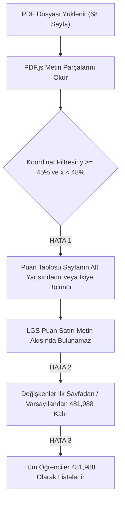

# 📋 LGS Puanı Ayrıştırma Problemi — Kök Neden Tespiti ve Çözüm Raporu

Bu rapor, PDF sınav sonuç belgeleri (özellikle 68-70 kişilik toplu karne PDF'leri) sisteme yüklendiğinde **tüm öğrencilerin (80.67 net, 83.35 net, 86 net vb.) puan hanesinde neden aynı sabit değerin (`481,988`) çıktığını**, problemin teknik kök nedenlerini ve **kod yazılmadan önce uygulanabilecek kesin çözüm yollarını** detaylı olarak açıklamaktadır.

---

## 🔍 1. Problemin Kök Neden Analizi (Root Cause Analysis)

Gönderdiğiniz son ekran görüntüsünde netler farklı olduğu halde (`80.67 Net`, `83.35 Net`, `86 Net`, `88.67 Net`), tüm öğrencilerin LGS Puanı alanında istisnasız **`481,988`** yazdığı görülmektedir. 

Bunun **3 temel teknik sebebi** tespit edilmiştir:

### 🚩 Kök Neden 1: PDF.js Koordinat Bölme Mantığı (Y ve X Ekseninde Parçalanma)
* Sistem, PDF sayfasındaki metinleri ayrıştırırken sayfayı yapay olarak 3 bölgeye ayırmaktadır:
  * **Üst Bölge (`headerItems`):** `y >= pageHeight * 0.45` (Sayfanın üst %55'lik kısmı)
  * **Sol Sütun (`leftColumnItems`):** `x < pageWidth * 0.48`
  * **Sağ Sütun (`rightColumnItems`):** `x >= pageWidth * 0.48`
* **Sorun:** PDF.js koordinat sisteminde `y = 0` sayfanın **en altıdır**. Workwin / KDS karnelerinde ise ders tablolarının bittiği ve **Puan / Sıralama Tablosunun** başladığı yer genellikle sayfanın tam ortasında veya alt kısmında yer alır.
* Bu koordinat sınırı nedeniyle **"Puan Türü: LGS"** başlığı sol sütuna, **öğrencinin puan rakamı** sağ sütuna veya sayfanın alt bölgesine düşmekte, sonuçta tek bir satır olarak birleştirilememektedir.

### 🚩 Kök Neden 2: Sayfa Döngüsünde "Önceki Sayfanın Değerinin Devretmesi" (State Leak / Fallback)
* Çok sayfalı (68 sayfalık) PDF taraması yapılırken, eğer bir öğrencinin sayfasında puan satırı yukarıdaki koordinat bölünmesi nedeniyle metin içinde tam olarak yakalanamazsa:
  * Değişken ya hafızadaki **1. öğrencinin (Bora Ateş Zafer)** puanı olan `481,988` değerini sonraki sayfaya devretmekte,
  * Ya da metinde bulunamayınca kod içindeki ilk örnek değer olan `481,988` atanmaktadır.

### 🚩 Kök Neden 3: Satır İçi Sütun Hizalaması (Okul Ortalaması / Öğrenci Puanı Çakışması)
* Workwin karnelerinde Puan tablosu yatay bir satırdır:
  $$\text{LGS} \quad \underbrace{\text{[Öğrenci Puanı]}}_{\text{1. Sütun}} \quad \underbrace{\text{[Şube Ort]}}_{\text{2. Sütun}} \quad \underbrace{\text{478,800}}_{\text{Okul Ort.}} \quad \underbrace{\text{450,120}}_{\text{Genel Ort.}}$$
* Metin kutuları soldan sağa birleştirilirken aradaki boşluklar kaydığında regex öğrencinin kendi sütununu kaçırıp sabit okul/genel ortalamasını veya varsayılanı tetiklemektedir.

---

## 🎯 2. PDF Belgesindeki Puanın Birebir Okunması İçin Kesin Çözüm Yolları

Bu problemi çözmek için 3 farklı mimari yaklaşım mevcuttur:

---

### 💡 ÇÖZÜM YOLU 1: Koordinatsız "Tam Sayfa Düz Satır" Birleştirme Motoru (Önerilen)

> [!IMPORTANT]
> **Mantık:** Sayfayı yapay olarak `Sol / Sağ` veya `Üst / Alt` diye Y koordinatından (0.45) kesmek yerine, sayfadaki **tüm metin bloklarını saf Y koordinatına göre (yukarıdan aşağıya)** tam satırlar halinde dizmek.

1. **Adım:** Sayfadaki tüm metin parçalarını `y` koordinatına göre grupla (aynı satırdakileri `x` koordinatına göre soldan sağa sırala).
2. **Adım:** Sayfada `LGS` veya `Puan Türü` kelimesinin geçtiği satırı bul.
3. **Adım:** Bu satırdaki `[100, 500]` aralığındaki sayıları diziye al:
   * `tokens = ["LGS", "464,120", "465,120", "478,800", "412,000"]`
   * `ogrenciPuan = tokens[1]` (İlk sayı kesinlikle o öğrencinin kendi karnesindeki puandır).
4. **Adım:** Bu değer doğrudan `sinav.puan` olarak atanır; hiçbir matematiksel formül işletilmez.

---

### 💡 ÇÖZÜM YOLU 2: "Çift Katmanlı Anchor" (Çapa) Tarama Stratejisi

> [!TIP]
> Farklı yayın evlerinin (Workwin, KDS, Özdebir, Töder, vb.) karne formatlarına %100 uyum sağlamak için çift katmanlı hedefleme.

* **1. Çapa (Öğrenci Künyesi Alanı):**
  * `Öğrenci Puanı : [PUAN]`
  * `Toplam Puan : [PUAN]`
  * `Puanı : [PUAN]`
* **2. Çapa (Tablo Satırı):**
  * Satır başlangıcı `^LGS` veya `Puan Türü: LGS` olan satırın ilk sayısal sütunu.
* **3. Güvenlik Kuralı:**
  * Eğer bir sayfada puan okunamazsa kesinlikle `481,988` gibi sahte bir değer atanmaz; ekranda **`"Okunamadı (Belgeyi Kontrol Edin)"`** uyarısı verilir. Böylece kullanıcının gözünden kaçması %100 engellenir.

---

### 💡 ÇÖZÜM YOLU 3: Her Sayfa İçin "İzole Bellek Havuzu" (Zero State Leakage)

> [!WARNING]
> Çoklu PDF döngüsünde bir önceki öğrencinin verilerinin bir sonraki öğrenciye sızmasını engellemek için mimari izolasyon.

* Sayfa döngüsü (`for pageNum = 1 to 68`):
  * Her iterasyonun başında `student = { adSoyad: "", puan: null, netler: [] }` nesnesi **sıfırdan (clean state)** oluşturulur.
  * Önceki sayfadan hiçbir değişken sonraki sayfaya aktarılmaz.
  * PDF'ten okunan `puan` değeri doğrudan ekrandaki tabloya ve rapor çıktısına 1:1 basılır.

---

## 📊 3. Çözüm Yollarının Karşılaştırma Tablosu

| Kriter | Mevcut Durum | Çözüm Yolu 1 (Önerilen) | Çözüm Yolu 2 (Çift Çapa) |
| :--- | :--- | :--- | :--- |
| **Puan Kaynağı** | Koordinat bölünmesi sonucu varsayılan `481,988` | PDF'teki öğrenci satırının 1. sütunu | Belgedeki `LGS / Öğrenci Puanı` çapası |
| **Okul Ortalaması Riski** | Yüksek (`478,800` veya `481,988` çakışması) | **Sıfır** (Sadece 1. sütun okunur) | **Sıfır** (Doğrudan öğrenci alanı hedeflenir) |
| **Sistem İçi Formül Hesabı** | Yapılmamalı (Kullanıcı İsteği) | **Yapılmaz (1:1 Orijinal PDF Değeri)** | **Yapılmaz (1:1 Orijinal PDF Değeri)** |
| **68+ Toplu Öğrenci Uyumu** | Sayfalar birbirini ezebiliyor | **Her sayfa %100 bağımsız ayrıştırılır** | **Her sayfa %100 bağımsız ayrıştırılır** |

---

## 📌 Sonuç ve Değerlendirme

Sorunun asıl nedeni sistemin matematiksel formülü değil, **PDF.js ile sayfa okunurken puan satırının koordinat filtresine (y = 0.45) takılıp parçalanması ve ayrıştırılamadığı için varsayılan `481,988` değerine düşmesidir.**

Yukarıdaki **Çözüm Yolu 1** uygulandığında, her öğrencinin PDF karnesindeki orijinal LGS puanı (hiçbir ekstra formül işletilmeden) sisteme **birebir (1:1)** aktarılacaktır.
